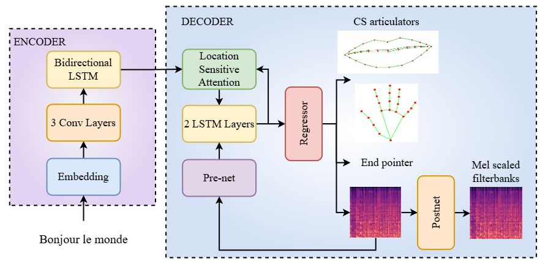

# **AVTacotron2 for Automatic Cued Speech Generation (ACSG): Audiovisual Text-To-Cued Speech Model**

This repository contains the implementation of **AVTacotron2 for ACSG**, an audiovisual Text-to-Cued Speech model used as a baseline in the paper:  
📄 **[Cued Speech Generation Leveraging a Pre-trained Audiovisual Text-to-Speech Model](https://arxiv.org/pdf/2501.04799)**  

This implementation is **forked from the [AVTacotron2 repository](https://github.com/MartinLenglet/AVTacotron2)** for audiovisual synthesis as interpreted by Martin Lengelet et al in *FastLips: an End-to-End Audiovisual Text-to-Speech System with Lip Features Prediction for Virtual Avatars*.  

---

## **📌 Overview**
The **AVTacotron2** architecture is based on **Tacotron2**, described in:  
🔗 **[Natural TTS Synthesis By Conditioning Wavenet On Mel Spectrogram Predictions](https://arxiv.org/pdf/1712.05884.pdf)**  

- Mel-spectrogram frames are predicted from a linear projection after the second LSTM layer of the decoder.  
- In this AVTacotron2 version, **visual features (hand and lips)** are predicted from a second linear projection at the same layer.  
- Visual features are not integrated into the autoregressive process (no postnet is applied to them).  
- **MediaPipe 2D skeletal points** are used for hand and lip feature extraction, ensuring the same sampling rate as the mel-spectrogram.  
- No emotion modeling is included in this implementation.  

📷 **AVTacotron2 for ACSG Architecture**  
  

---

## **🔧 Modifications to the [NVIDIA Implementation](https://github.com/NVIDIA/tacotron2)**  

### **🗂️ Data Loading**
1. **Text Processing Adaptation:** Modified `text/__init__.py`, `text/symbols.py`, and `text/cmudict.py` for the [French corpus](https://zenodo.org/records/7560290#.Y85YpC_pMzw) from the [Blizzard Challenge 2023](https://hal.science/hal-04269927/document).  
2. **Visual Parameters:** Added visual parameter handling in `hparams.py`.  
3. **Audio-Visual Sampling:** Adapted `data_utils.py` to up/down-sample AU features to match the mel-spectrogram sampling rate.  
4. **Dataset for Cued Speech Generation:** **[CSF23]**() *(to be added)*  

### **🎥 Visual Feature Prediction**
5. **Visual Sequence Prediction:** Implemented for hand and lips in `model.py`.  
6. **Loss Function:** Integrated **Mean Squared Error (MSE)** loss for hand & lip visual features in `loss_function.py`, also adding it to the total loss during training.  

### **🚀 Inference**
Script: `inference.py`  
7. **Text-to-Speech (TTS) Inference:**    
   - Use **[Waveglow](https://github.com/NVIDIA/waveglow)** for vocoding.  
8. **Cued Speech Synthesis:** 
   - To Visualize, Run `Visualize-DTW.ipynb`
---

## **🌍 Demo Page**  
Under Cued Speech Synthesis at [My PhD](https://sites.google.com/view/sanjana-sankar/my-phd)

---

## **⚡ Quickstart**  

### **🖥️ Prerequisites**
- NVIDIA **GPU** with **CUDA** & **cuDNN**  

### **📦 Setup**
1. **Clone the repository:**  
   ```bash
   git clone https://github.com/your-username/AVTacotron2.git
   cd AVTacotron2

2. Install python requirements: `pip install -r requirements.txt`

3. To update hparams.py:
    1. wav-/mel-paths 
    2. training-/validation files
    3. prefix and suffix for the visual data repositories

## Training
`python train.py --output_directory=outdir --log_directory=logdir`

## Inference
TTS : `python inference.py`  
ACSG: `python inference.py` + `jupyter notebook Visualize-DTW.ipynb` to Visualize

# Acknowledgements
This work, as part of the Comm4CHILD project, has received funding from the European Union’s Horizon 2020 research and innovation programme under the Marie Sklodowska-Curie Grant Agreement No 860755.

<!-- # Citation
    @inproceedings{lesankar2025acsg,
        title={Cued Speech Generation Leveraging a Pre-trained Audiovisual Text-to-Speech Model},
        author={Sankar, Sanjana and Lenglet, Martin and Bailly, G{\'e}rard and Beauemps, Denis and Hueber, Thomas},
        booktitle={Proc. of ICASSP},
        pages={to be updated},
        year={2025}
    } -->